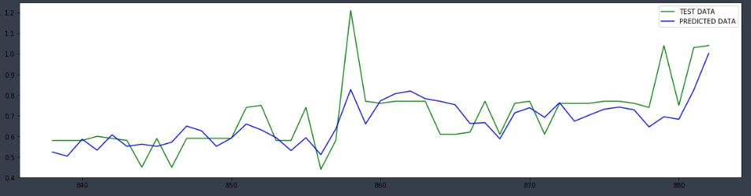

## Objective 1 (predict y1 with shuffled train test split) scores: 
* R2 Score 0.793 
* RMSE 0.012 

## Objective 2 (predict y1 with unshuffled train test split) scores: 
* R2 Score 0.046 
* RMSE 0.012 

## Objective 3 (predict y2 with unshuffled train test split) scores: 
* R2 Score 0.516 
* RMSE 0.107 

